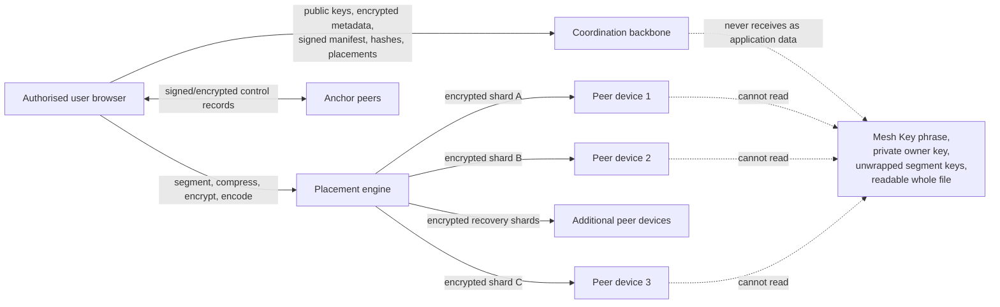
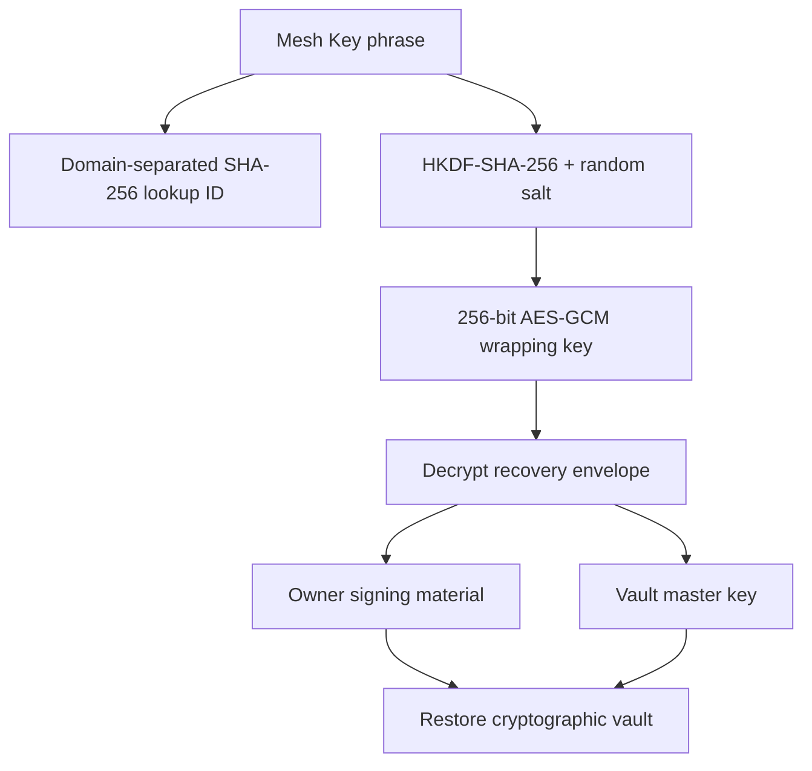
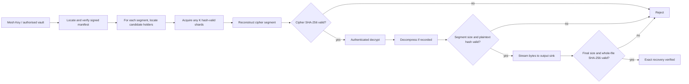
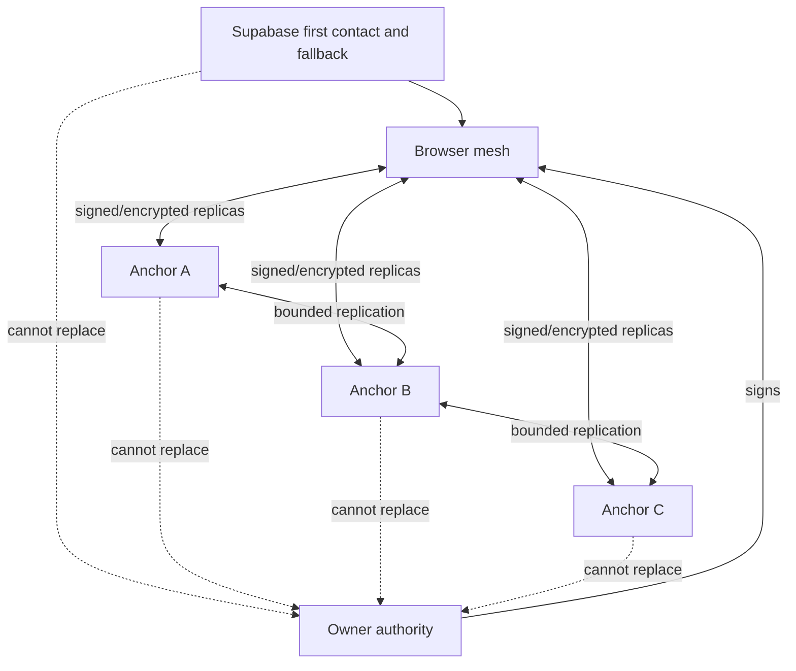

# TheMeshVault
## Defensive Publication and Technical Manifest for Account-Free, Peer-Distributed, Recoverable Storage

**Document identifier:** TMV-DP-001  
**Version:** 1.1  
**Document date:** 28 July 2026  
**Originating project:** TheMeshVault (`app717`)  
**Publication status:** Publication candidate — locally created, not yet publicly published  
**Technical field:** Distributed storage, browser cryptography, peer-to-peer networking, erasure coding, cryptographic identity, resilient control planes and mobile edge participation

---

## Publication notice

This document intentionally discloses the architecture, processes, data structures and alternative embodiments of TheMeshVault in enough technical detail for a person skilled in distributed systems, applied cryptography and web networking to understand and implement the disclosed teachings.

The purpose is defensive publication: after this document is made genuinely available to the public without a confidentiality restriction, the disclosed subject matter may become relevant prior art against later patent claims covering the same or obvious variants of the disclosed combinations.

Creating this file in a private workspace does **not** make it a public disclosure. Public availability, a provable publication date and preservation of the published version are separate steps. Publication can also severely limit the authors' own ability to obtain patent protection. Obtain patent-law advice before public release if any patent rights may still be desired.

This is a technical disclosure, not a patent application, legal opinion, security certification, service-level promise or licence grant. Copyright, trademark and software-licence questions are separate from whether a technical teaching has been publicly disclosed.

Official background:

- WIPO explains that public defensive publication may establish prior art and may also prevent the publisher from later obtaining patent protection: <https://www.wipo.int/en/web/patents/faq_patents>
- EPO guidance describes prior art as written teaching made available to the public before the relevant filing date and explains that the disclosure should enable a skilled person to put the teaching into practice: <https://www.epo.org/en/legal/guidelines-pct/2026/g_iv_1.html> and <https://www.epo.org/en/legal/guidelines-epc/2026/g_iv_2.html>

---

## 1. Abstract

TheMeshVault is a distributed file-storage system in which a user's browser or client:

1. creates a cryptographic vault identity without requiring a named account;
2. reads each file in bounded segments;
3. selectively compresses each segment;
4. encrypts each segment independently with authenticated encryption;
5. erasure-codes each encrypted segment into a dynamic number of recovery shards;
6. places the shards on independently identified peer devices;
7. records a signed, content-addressed manifest describing exact recovery;
8. repairs and rebalances placement as devices appear and disappear; and
9. reconstructs, decrypts, decompresses and verifies the original file byte for byte.

Readable file content, private vault authority and unwrapped content keys remain at authorised clients. Storage peers hold encrypted shards. A coordination layer may hold pseudonymous sessions, public keys, encrypted metadata, signed manifests, shard hashes, placement records, recovery envelopes and transient signaling, but is not trusted as the owner or plaintext file store.

The disclosed system separates:

- **cryptographic ownership** from a hosted account;
- **logical segmentation** from network packetisation;
- **required recovery threshold K** from **proactive repair threshold R** and **target shard count N**;
- **storage nodes** from **control-plane Anchor nodes**;
- **verified resilience** from unverified availability claims; and
- **a visible file deletion** from verified removal of encrypted copies held by temporarily offline devices.

The current implementation is browser-first and uses WebRTC for peer transport, browser-local OPFS/IndexedDB for shard storage and Supabase as a pseudonymous coordination backbone. Alternative implementations can use native mobile wrappers, desktop clients, servers, removable storage or opaque third-party storage adapters while preserving the same cryptographic and recovery model.

---

## 2. Problem addressed

Conventional personal cloud storage usually requires the user to trust a central operator with availability, account control, metadata and often file custody. Conventional peer-to-peer storage systems can instead suffer from one or more of the following:

- the original uploader must stay online;
- a file is loaded into memory as one large buffer;
- encryption, compression and redundancy are applied to the whole file rather than bounded units;
- “redundancy” counts multiple copies on the same physical device;
- shard count is fixed even when the network grows;
- a coordinator is treated as the source of truth;
- restoration depends on a conventional email account;
- deletion falsely implies immediate erasure from offline devices;
- repair creates surplus copies without deterministic reconciliation;
- deduplication leaks whether another user has the same content; or
- displayed capacity and resilience are simulated rather than supported by observed evidence.

TheMeshVault addresses these problems through a browser-executable, cryptographically owned and evidence-based storage protocol.

---

## 3. Terminology

| Term | Meaning in this disclosure |
|---|---|
| Vault | A cryptographically controlled namespace containing file metadata, versions, manifests and authorised operations. |
| Vault owner key | An asymmetric signing keypair whose public key determines the Vault ID. |
| Vault ID | A self-certifying identifier derived by hashing the owner's public key. |
| Mesh Key | Human-portable recovery material used to derive a lookup identifier and decrypt a recovery envelope. |
| Device identity | A separate signing keypair and identifier for one browser profile or physical client. |
| Segment | A bounded logical portion of a file processed independently. The present implementation uses 8 MiB fixed boundaries. |
| MiB | Mebibyte: 1,048,576 bytes. Eight MiB is 8,388,608 bytes. |
| Representation | The original segment or its compressed form, whichever the policy selects. |
| Cipher segment | An independently authenticated encrypted representation. |
| Shard | One erasure-coded part of a cipher segment. It is not a transport packet. |
| Transport packet | A small network frame carrying part of a shard. The present implementation uses 32 KiB packets. |
| K | Minimum number of valid shards needed to reconstruct one cipher segment. |
| R | Number of active shards below which proactive repair starts. `K ≤ R ≤ N`. |
| N | Target number of distinct logical shards in the coding group. |
| Failure domain | A boundary whose loss should not remove multiple supposedly independent shards, such as browser profile, device, user, network or region. |
| Storage node | A participating client that stores encrypted shards. |
| Anchor | An opt-in node that additionally retains bounded signed or encrypted control records and assists an already-connected mesh. |
| Manifest | A signed, content-addressed recovery description for one file version. |
| Capability link | A signed sharing record plus secret key material kept in the URL fragment. |
| Coordination backbone | A discovery, signaling and metadata service that is operationally useful but not cryptographic owner of the vault. |

---

## 4. System overview



The system contains three distinct planes.

### 4.1 Authority plane

The owner key and vault master key establish authority. A hosted user account is not the root of ownership. Operations that affect ownership or trusted state can be signed and verified at clients.

### 4.2 Storage plane

Storage nodes retain immutable encrypted shards addressed by cryptographic hash. A node can serve, prove, delete or repair a shard without receiving the corresponding plaintext or segment key.

### 4.3 Coordination plane

The coordination plane provides discovery, signaling, metadata indexing, placement status, encrypted caches, repair scheduling and deletion progress. Its records remain subject to signature, hash and client-side decryption checks.

These planes may be deployed together or separately. Compromise of coordination should not by itself yield plaintext file content or vault signing authority.

---

## 5. Cryptographic ownership without a named account

### 5.1 Vault creation

An authorised client generates:

- an Ed25519 signing keypair where supported, with ECDSA P-256/SHA-256 as a compatibility alternative;
- a random 256-bit vault master key;
- a random Mesh Key phrase; and
- a separate device signing identity.

The public owner key is serialised and hashed with SHA-256. The resulting digest is the Vault ID:

```text
vault_id = SHA-256(canonical_owner_public_key)
```

This makes the identifier self-certifying: a verifier can confirm that an operation's public owner key corresponds to the stated Vault ID before checking its signature.

### 5.2 Device separation

Each browser profile or installed client generates its own device keypair and device identifier. Restoring the same vault on another client restores vault authority but does not reuse the old device identity. This separates:

- ownership of the vault;
- authority of a particular trusted device; and
- physical storage participation.

Trusted-device registration and revocation can be represented as owner-authorised signed operations.

### 5.3 Pseudonymous coordination session

The present implementation creates a Supabase Auth user marked anonymous when hosted coordination is needed. No name, email or password is required, but the session and stable vault/device identifiers remain pseudonymous and linkable over time. “No named account required” is therefore distinct from network anonymity.

---

## 6. Mesh Key recovery

The present Mesh Key contains six groups of seven base-36 characters. Presentation separators and copied whitespace can be normalised before derivation.

The phrase is used in two separate derivations:

1. a domain-separated SHA-256 lookup identifier locates an encrypted recovery envelope; and
2. HKDF-SHA-256 with a random salt and domain-separation label derives a 256-bit AES-GCM wrapping key.

The encrypted recovery envelope contains the vault identifier, owner key material and vault master key. The phrase itself is not uploaded.



Two recovery modes are disclosed:

- **phrase lookup:** use the derived lookup ID to retrieve the encrypted envelope from Supabase, an Anchor cache or another provider;
- **complete recovery kit:** carry the phrase and its encrypted envelope together in a local JSON bearer file, allowing the same cryptographic vault identity to be restored without a network envelope lookup;
- **legacy recovery file:** carry only the encrypted envelope in a version-1 JSON file and combine it with the matching phrase locally.

The current release normally requires Supabase for a cold phrase-only lookup. An already available complete recovery kit does not require that lookup and must be protected as a bearer credential because anyone holding the file can restore the vault identity. Anchors can cache recovery control material as an alternative provider, but the current implementation does not yet claim universal Supabase-independent cold discovery.

Alternative embodiments may use Argon2id, scrypt or another memory-hard password KDF in addition to or instead of HKDF; secret sharing of recovery material; hardware-backed keys; passkeys; social recovery; QR transfer; or multiple independently encrypted recovery envelopes.

---

## 7. Streaming file-ingest pipeline

### 7.1 Hierarchy

```text
File
  → bounded logical segments
    → optional adaptive compression
      → authenticated encryption per segment
        → erasure-coded shards per segment
          → small transport packets per shard
```

A transport packet is not a database fragment and does not receive a separate long-term encryption record. Encryption and erasure coding operate at segment level; packetisation is only a transport concern.

### 7.2 Current limits

The present browser release enforces:

- maximum file size: 100,000,000 bytes;
- target segment size: 8 MiB or 8,388,608 bytes;
- default contribution limit: 1 GiB;
- maximum selectable browser contribution: 10 GiB; and
- bounded processing intended to avoid a whole-file memory buffer.

The 100 MB release limit is a product safety boundary, not an architectural maximum.

### 7.3 Segmentation

The browser obtains a `ReadableStream` from the file and fills one segment-sized buffer. When the buffer reaches the target size, the segment is yielded for processing. The final segment may be smaller.

The present boundary method is recorded as `fixed-8MiB`. Stable fixed boundaries permit segment reuse when later file versions retain the same aligned content.

Alternative embodiments may use:

- fixed sizes from approximately 1 MiB to 64 MiB;
- content-defined chunking using rolling hashes;
- variable size selected by device memory and network conditions;
- file-type-specific boundaries; or
- a hybrid of large logical segments and smaller deduplication chunks.

The selected boundary method and parameters are stored in the manifest so versions remain decodable.

### 7.4 Adaptive compression

For each segment:

1. inspect file extension and MIME type;
2. skip compression for formats likely already compressed;
3. otherwise compress the segment independently;
4. retain the compressed form only if it saves at least a configured threshold; and
5. record the chosen method and sizes.

The present implementation uses gzip and a minimum saving of 5%. It skips common compressed images, audio, video, archives, office containers and PDF, including JPEG, PNG, WebP, AVIF, HEIC, MP4, WebM, MP3, ZIP, gzip, 7z, RAR, PDF, DOCX, XLSX and PPTX.

Alternative methods include Brotli, Zstandard, LZ4 or future codecs. The selection criterion may include CPU, battery, temperature, transfer price and expected node availability in addition to byte savings.

### 7.5 Per-segment authenticated encryption

Each new unique segment receives:

- a random 256-bit segment key;
- a unique random 96-bit AES-GCM nonce;
- domain-separated additional authenticated data;
- a plaintext segment hash stored inside encrypted private metadata; and
- a ciphertext hash used before decryption and reconstruction.

The segment key is wrapped by the vault master key. Segment private metadata is also encrypted under the vault master key. The nonce is included with the cipher representation and can also be recorded inside encrypted private metadata.

The present implementation uses AES-256-GCM. Equivalent embodiments may use ChaCha20-Poly1305, AES-GCM-SIV or another authenticated-encryption construction with safe nonce handling.

### 7.6 Erasure coding

The cipher segment is encoded independently using Reed-Solomon coding. For a profile `K+P`:

- `K` is the data-shard count and recovery minimum;
- `P` is parity-shard count; and
- `N = K + P` is target logical shard count.

Any K valid shards from the same coding generation can reconstruct the cipher segment. Each shard is hashed before placement. A client verifies the received shard hash, reconstructed cipher hash, authenticated decryption, plaintext segment hash, original segment size and final whole-file hash.

Alternative coding constructions include fountain codes, locally repairable codes, regenerating codes or replicated encrypted segments. The disclosed K/R/N lifecycle remains applicable where recovery, repair and target counts can be separated.

---

## 8. Dynamic K/R/N profiles

The present standard profiles are:

| Minimum independent nodes | K required | R repair threshold | N target | Missing shards tolerated at recovery |
|---:|---:|---:|---:|---:|
| 5 | 3 | 4 | 5 | 2 |
| 6 | 4 | 5 | 6 | 2 |
| 8 | 6 | 7 | 8 | 2 |
| 10 | 7 | 9 | 10 | 3 |
| 16 | 12 | 14 | 16 | 4 |

A high-resilience 16-node profile uses K=10, R=13 and N=16, tolerating six unavailable shards for recovery.

K, R and N serve different purposes:

- below K, recovery is impossible for that segment;
- from K to R-1, recovery is possible but repair should begin;
- from R through N, the group meets the current operating target; and
- above N, additional verified copies are surplus rather than new logical shards.

Profiles may be upgraded through a new immutable coding generation when more independent nodes become available. Old and new generations may coexist during migration. A manifest format version and storage protocol version allow legacy and current files to remain readable.

---

## 9. Placement across failure domains

### 9.1 Hard separation rule

Within one erasure-coding group, two shards must not be counted as independently protected if they reside in the same browser profile or declared device failure domain.

The implementation rejects a placement candidate when its failure-domain identifier is already occupied by another shard in the group. A claim such as “survives two device losses” is made only when enough currently verified shards occupy enough independent device domains.

### 9.2 Candidate eligibility

A node is eligible only if it has sufficient remaining capacity after:

- a reserve of at least 5% or 32 MiB, whichever is greater; and
- shard headroom of approximately 1.2 times the shard size.

Repeatedly poor observed quality can exclude a node after a minimum sample count.

### 9.3 Candidate ranking

The placer maintains both a coding-group context and a file-wide context. The group context enforces unique failure domains. The file context counts placements and bytes per node, calculates a soft per-node cap from the expected file placements and eligible-node count, and persists for every segment processed in that operation.

Eligible nodes are ranked using:

1. remaining room below the file-wide soft node cap;
2. no existing placement from this file;
3. new country, then new region within the coding group;
4. new salted network-domain hash within the coding group;
5. lower file-wide placement and byte counts;
6. a stable weighted rendezvous score derived from file-version, segment, generation and shard identity plus measured capacity, reliability and quality;
7. measured availability and successful transfer/proof quality;
8. lower storage utilisation;
9. higher observed throughput; and
10. lower observed round-trip time.

The cap is soft: a small mesh can reuse devices when necessary, but reuse remains balanced. A sufficiently large candidate set gives successive segments different stable device cohorts instead of repeatedly selecting the same highest-ranked nodes. Upload, profile upgrade and repair apply the same file-wide rule.

Unknown geography is neutral. It is not treated as proof of physical separation.

### 9.4 Location

A node may derive a coarse country code through browser location permission and local country-boundary data, or receive a coarse edge hint. Precise coordinates need not be retained. Country, region, network and browser profile are separate failure-domain signals and may be weighted according to deployment needs.

Alternative embodiments may add power-grid zone, autonomous system, operator, rack, data centre, legal jurisdiction, device owner or hardware attestation, provided the system does not claim unverified diversity.

---

## 10. Shard transport and browser storage

### 10.1 WebRTC transport

Participating clients use WebRTC DataChannels with STUN and optional TURN. The current transport:

- uses 32 KiB shard packets;
- limits queued DataChannel bytes to approximately 1 MiB;
- hashes complete received shards before accepting them;
- measures RTT, throughput, successful transfers and proof outcomes;
- allows a bounded 45-second shard proof or transfer window; and
- requests a needed shard from all currently reachable candidates in parallel rather than serially assuming desktop response times.

Wrong or unavailable peers simply do not produce a valid shard. Only hash-verified bytes are accepted.

### 10.2 Local storage

Encrypted shard bytes are stored in Origin Private File System storage when available, with IndexedDB as metadata and fallback storage. Storage is scoped to the application origin and contribution quota.

Alternative storage adapters may implement the same content-addressed interface:

```text
put(shard_hash, encrypted_bytes)
get(shard_hash) -> encrypted_bytes | unavailable
has(shard_hash) -> boolean
delete(shard_hash, signed_authorisation) -> acknowledgement
prove(shard_hash, challenge) -> verified response
capacity() -> measured total and used bytes
```

Such adapters may use a native Android/iOS filesystem, desktop filesystem, server disk, removable media, home NAS or a user's cloud drive. A cloud-drive adapter stores opaque encrypted shards and must not be treated as vault authority merely because it supplies storage capacity.

---

## 11. Signed cryptographic manifest

Each file version has a signed, content-addressed manifest. The present version is manifest format 2 and storage protocol 2.

The manifest includes:

- manifest and storage protocol versions;
- Vault ID and file-version ID;
- owner public key and signature algorithm;
- creation time;
- original file size and streaming SHA-256;
- segment count and boundary method;
- for every segment:
  - segment identifier;
  - original, stored and cipher sizes;
  - compression method;
  - coding generation;
  - K, parity count, R and N;
  - cipher hash;
  - wrapped segment key;
  - encrypted private metadata containing plaintext hash, nonce and AAD;
  - ordered shard hashes; and
  - observed durable placements with shard index, node, failure domain and role.

The manifest core is canonicalised, hashed and signed. A manifest identifier is derived from the signed envelope. A client checks the content address, owner/Vault ID relationship, signature, version compatibility and internal fields before using it.

Readable filenames and sensitive private segment metadata remain encrypted outside or inside the signed envelope as appropriate.

---

## 12. Vault-scoped deduplication and version reuse

Before encryption, each plaintext segment is fingerprinted with HMAC-SHA-256 under the vault master key and a domain-separation label:

```text
fingerprint = HMAC-SHA-256(vault_master_key,
                           "meshvault-vault-dedup-v1" || plaintext_segment)
```

The same vault can reuse an already verified encrypted segment across file versions. A different vault produces a different fingerprint for identical plaintext, preventing the coordination layer from using the fingerprint as a cross-account file-existence oracle.

Reference counts or version-segment links prevent deletion of shared segment material while another live version still references it.

Alternative embodiments may combine fixed and content-defined boundaries, maintain encrypted version trees, or use private set membership inside one vault. Cross-user deduplication is deliberately excluded from the initial privacy model unless a future construction prevents confirmation and ownership leakage.

---

## 13. Exact recovery procedure



For each segment, the client checks local storage, connected peers, peer gossip, Anchor providers and the hosted bootstrap provider. It acquires at least K independently indexed shards and reconstructs the original cipher length. It then:

1. verifies the reconstructed cipher hash;
2. unwraps the segment key;
3. performs authenticated decryption with recorded AAD;
4. decompresses according to the manifest;
5. verifies original segment length and plaintext hash;
6. writes the segment to a streaming output sink; and
7. updates a streaming whole-file SHA-256.

The client reports exact recovery only if the final byte count and whole-file hash equal the signed manifest. Temporary shards acquired merely for recovery are removed unless the node is an authorised durable holder.

The uploader is not required if the manifest and K valid shards for every segment remain discoverable.

---

## 14. Repair, rebalancing and returning nodes

### 14.1 Availability states

A placement can progress through states such as:

```text
pending → stored → verified
verified → suspect → unavailable
verified → surplus → retiring → deleted
stored → deleting → deleted
```

A silent node first becomes suspect. The present implementation uses:

- node stale interval: 120 seconds;
- proof freshness: 30 minutes;
- repair grace: 30 minutes; and
- surplus cleanup grace: 5 minutes.

Repair does not immediately duplicate every temporarily silent shard. After grace, if active logical shards fall below R but remain at or above K, repair reconstructs missing logical shards and places verified replacements until the target is restored where possible.

### 14.2 Rejoining and surplus

If old devices return after replacements were made, physical copies may exceed N. The system does not redefine N upward merely because extra copies exist. It:

1. verifies returning copies;
2. groups copies by logical shard identity;
3. selects a keeper using failure-domain novelty, reliability and proof freshness;
4. marks other copies surplus;
5. observes a cleanup grace; and
6. issues deletion only after a valid keeper remains.

This resolves, for example, a temporary 13/10 physical-copy state back to 10 logical placements without reducing recovery below the required threshold.

### 14.3 Immutable profile upgrade

When the mesh grows, the client can reconstruct a cipher segment from the current generation and encode a new K/R/N generation. The new generation receives its own shard hashes and placements. The old readable generation remains until the new one is signed, sufficiently placed and verified.

---

## 15. Durable deletion in an intermittently connected mesh

Deletion is a distributed protocol, not merely removal of a database row.

For each known placement, the owner creates a node-bound signed deletion authorisation containing at least:

- Vault ID;
- file/version or segment context;
- shard hash;
- intended node ID;
- issue/expiry or replay-control data; and
- owner signature.

The system performs the following order:

1. revoke known capability links where coordination is reachable;
2. persist every signed node-bound deletion order;
3. tombstone the file from the user's visible vault;
4. send orders to connected holders;
5. require each holder to verify owner authority, node binding and shard hash;
6. retain the encrypted shard if another live file/version still references the same physical content;
7. otherwise remove the local shard and location announcement;
8. acknowledge the placement as deleted; and
9. finalise metadata only after all known placements acknowledge.

An offline holder processes its pending order when the same browser profile or device reconnects. If it never returns, the encrypted shard may physically remain on that device, but it is no longer a live vault placement and cannot be reconstructed without sufficient other shards and key material.

The user may hide deletion progress locally without cancelling the signed operational order.

---

## 16. Capability-based sharing

A file owner can share one file version without transferring vault ownership.

The owner:

1. generates a random 192-bit capability identifier;
2. generates a random 256-bit capability key;
3. unwraps the relevant segment keys locally;
4. encrypts the segment-key bundle under the capability key with AES-GCM;
5. signs a core containing manifest ID, expiry, optional download limit and single-use flag;
6. stores the signed encrypted capability record in coordination; and
7. places the capability key only in the URL fragment.

Browsers do not normally send URL fragments in HTTP requests. The recipient presents the capability identifier to coordination, verifies the owner signature and expiry, uses the fragment key to open the segment bundle, retrieves shards and verifies exact recovery.

An optional password hash can add an application check. Strong password-based sharing may instead derive the capability key using a memory-hard KDF.

Revocation prevents future coordinated redemption while the revocation check is reachable. It cannot force deletion of plaintext already downloaded by a recipient.

---

## 17. Supabase backbone and trust boundary

The current release uses Supabase Auth, Postgres, Realtime and an Edge Function as its hosted first-contact, persistent coordination and immediate fallback backbone. After three healthy Anchors have remained directly connected for two minutes, current clients prefer the Anchor path for discovery, signaling relay and bounded control replication. This reduces steady-state Realtime fan-out but does not remove the persistent Supabase responsibilities listed below.

### 17.1 Supabase currently performs

- anonymous-session creation and RLS scoping;
- vault and device public registration;
- owner-signed encrypted private vault-profile synchronisation;
- public pseudonymous node-label publication;
- bounded first-contact discovery and WebRTC signaling fallback through app-owned recipient topics protected by random 256-bit tokens;
- encrypted file/folder metadata storage;
- file-version, segment, shard and placement indexing;
- signed/encrypted manifest caching;
- encrypted recovery-envelope lookup;
- transfer, repair and deletion coordination;
- capability publication and revocation;
- coarse location, capacity, lease and reliability reporting;
- audit events;
- TURN credential delivery; and
- network total aggregation.

### 17.2 Supabase does not receive as intended application data

- the Mesh Key phrase;
- plaintext owner private keys;
- unwrapped segment keys;
- readable file content; or
- a central whole-file backup in Supabase Storage.

Supabase can see ordinary connection metadata and pseudonymous technical identifiers. Database rows are not assumed truthful merely because they are returned by Supabase. Clients verify signatures, hashes, content addresses, recovery thresholds and authenticated encryption.

The optional vault name and the public node label have deliberately separate privacy domains. The vault name is encrypted with vault-held key material before its signed ciphertext is synchronised, so a restored authorised browser can display it without publishing it to the mesh. The per-browser node label is public pseudonymous coordination metadata and can be shown to connected peers in Live Mesh. Neither label is proof of a person's legal identity.

### 17.3 Outage boundary

An already-open vault with cached manifests and established peer connections can continue discovery, multi-hop signaling relay, signed repair advisories and some recovery/control operations while Supabase is unavailable. Current cold peer discovery, phrase-only recovery lookup, new metadata writes and atomic repair/deletion job claims normally depend on Supabase.

The architecture therefore distinguishes “Supabase is not cryptographic owner or file-content store” from the stronger and currently false claim “Supabase is unnecessary.”

---

## 18. Anchor control layer

An Anchor is a participating node that opts into bounded replication of signed or encrypted control records. It may store:

- signed manifests;
- signed operation-log entries;
- encrypted recovery envelopes;
- short-lived peer presence;
- short-lived fragment-location announcements; and
- relayed WebRTC signaling for already-known participants.

Current default Anchor parameters include:

- 100 MiB control cache;
- selectable range approximately 25 MiB to 1 GiB;
- three primary Anchor assignments plus two deterministic reserves per client where enough independent healthy Anchors exist;
- replication target of three other Anchors;
- 60-second Anchor control cycle;
- approximately 90-second hosted heartbeat before Anchor-primary mode and 120 seconds for ordinary Anchor-primary clients, with jitter;
- 30-day manifest and operation-log retention;
- 120-second peer presence; and
- 5-minute fragment-location announcements.

An Anchor does not receive the Mesh Key, plaintext owner key, readable file or authority over another vault merely because it stores control records.



Anchor selection uses deterministic weighted rendezvous ranking with lease health, failure-domain diversity, reliability, bounded cache headroom and reported connection load. Three stable connected Anchors place a client in Anchor-primary mode; two use hybrid mode; fewer than two immediately restore Supabase-primary discovery and opaque recipient signaling. If Supabase is unavailable, two or more connected Anchors provide a degraded mesh path and fewer than two leave only local/already-established paths.

Repair needs are signed, gossiped and cached as expiring Anchor control objects. Supabase still provides the atomic repair-job claim when reachable, so the Anchor advisory is durable notification rather than an independent source of vault authority or a second competing job owner.

Future embodiments can make the Anchor layer a fuller distributed control plane using a signed append-only log, CRDT, quorum register, DHT or Byzantine-fault-aware consensus. The essential rule is that replicated coordination state remains subordinate to cryptographic vault authority and content verification.

---

## 19. Night Nodes, mobile participation and continuity

A browser, old phone, wrapped Android application, desktop or server can act as a longer-lived node. The present Night Node concept adds:

- renewable 90-second availability leases;
- 30-second lease renewal;
- measured uptime and reliability;
- Wake Lock and persistent-storage requests where supported;
- two buddy nodes for handoff;
- a ten-minute handoff checkpoint lifetime;
- optional service-worker push reminders that can help a user reopen a suspended Anchor; and
- a low-light, always-on operating view.

Anchor eligibility is determined by the renewable lease and current node status, not by notification permission. Enabling reminders contributes a small positive availability signal but is not a prerequisite. A selected buddy Anchor can ask the hosted Edge Function to send a rate-limited, user-visible Web Push notification through the endpoint chosen by the browser. The current implementation requires the recipient to tap that notification to reopen Night Node; it does not automatically run WebRTC or shard transfer in the service worker, and wake requests are not yet scheduled automatically. Disabling or losing the push subscription leaves an otherwise active Anchor and its lease unchanged.

Wake Lock, persistent storage, optional reminders and the low-light operating view improve observable availability but cannot force a mobile operating system to keep a browser process alive after screen lock or resource pressure.

A native mobile wrapper can add foreground-service execution, charging/network policies, native filesystem access, restart-on-boot and operating-system notifications while retaining the same segment, encryption, shard and manifest protocols.

An optional resource-exchange embodiment can grant more remote storage access to users who contribute measured capacity and uptime. Credits should be based on cryptographically verifiable storage proofs, successful transfers, availability leases and failure-domain value rather than self-reported capacity alone.

---

## 20. Honest measurements and user-visible state

The system distinguishes:

- original logical file bytes;
- compressed representation bytes;
- compression saving;
- cipher and shard overhead;
- physical bytes across acknowledged copies;
- number of logical segments;
- active shard count;
- K, R and N;
- independent device count;
- country, region and network-domain diversity;
- exact recovery verification;
- currently reported live-mesh capacity;
- direct peer count;
- repair backlog;
- surplus cleanup; and
- deletion acknowledgements.

Values are derived from signed manifests, verified transfers, proofs and persisted placement state. Unknown attributes remain unknown. A file is not labelled recoverable merely because a manifest exists.

Example:

```text
Original file:              100.0 MB
Compressed representation:  98.0 MB
Profile:                     7+3
Minimum required:            7 shards per segment
Repair threshold:            9 active shards
Target:                      10 shards
Physical mesh storage:       140.0 MB (example)
Independent devices:         10 verified domains
Exact recovery:              verified
```

The exact physical figure depends on cipher expansion, coding and acknowledged placement. It must be measured rather than inferred from a generic percentage.

---

## 21. Representative algorithms

### Algorithm A — upload

```text
input: file F, vault authority V, candidate nodes C
assert size(F) <= configured release limit
select profile (K, R, N) from independent eligible nodes
whole_hash = streaming_SHA256()

for each stable segment S of F:
    whole_hash.update(S)
    fingerprint = HMAC(vault_master_key, domain || S)

    if verified vault-local segment exists for fingerprint:
        reference existing encrypted segment
        continue

    R0 = compress(S) only if expected and measured saving >= threshold
    key = random 256-bit segment key
    cipher = AEAD_encrypt(key, unique_nonce, R0, bound_context)
    shards[0..N-1] = erasure_encode(cipher, K, N-K)

    for each logical shard:
        hash shard
        choose eligible node in a previously unused failure domain
        transfer in bounded packets
        require stored/hash acknowledgement
        record placement

    wrap key under vault master key
    retain private hash/nonce metadata encrypted

build canonical versioned manifest
sign manifest with owner key
replicate manifest and publish content address
```

### Algorithm B — placement

```text
reject node if:
    failure domain already used in coding group
    free capacity minus reserve < shard size * headroom
    measured quality is repeatedly below threshold
    lease or status makes node ineligible

rank remaining nodes by:
    remaining room below file-wide soft node cap
    no existing placement from this file
    new country / region
    new network domain
    lower file-wide placement and byte counts
    stable weighted rendezvous score for file / segment / shard
    measured availability
    transfer and proof success
    lower utilisation
    higher throughput
    lower RTT
```

### Algorithm C — recovery

```text
verify manifest content address, owner identity and signature
for each segment:
    acquire any K hash-valid shard indices
    reconstruct exact cipher length
    verify cipher hash
    unwrap segment key
    authenticated-decrypt
    decompress as recorded
    verify plaintext segment hash and length
    stream to output and update whole-file hash
verify final size and whole-file hash
report exact recovery only after every check succeeds
```

### Algorithm D — repair and reconciliation

```text
if holder stops reporting:
    mark placement suspect
    wait configured grace
    mark unavailable if still absent

if active logical shards < R and active logical shards >= K:
    reconstruct missing logical shard from K valid shards
    place replacement on new independent domain
    verify acknowledgement

if an old copy returns and physical copies > N:
    verify all candidate copies
    keep best failure-domain/reliability/proof candidate per logical shard
    mark others surplus
    after grace, delete surplus only while K/R safety remains
```

### Algorithm E — distributed deletion

```text
revoke known sharing capabilities
for each known placement:
    sign node-bound erase authorisation
    persist order before hiding file
tombstone visible file
send orders to online nodes
retain orders for offline nodes
node verifies signature, vault, node and shard binding
node preserves shard if another live reference exists
otherwise node erases shard and acknowledges
finalise coordination metadata after all known acknowledgements
```

---

## 22. Security properties and non-properties

### Intended properties

- A storage peer cannot ordinarily decrypt its shard without vault or capability key material.
- Modification of a shard, cipher, manifest or signed operation is detected.
- Any K valid shards from one coding generation reconstruct the encrypted segment.
- The final file is accepted only when its signed whole-file hash matches.
- Coordination compromise alone does not provide owner signing authority.
- Vault-scoped deduplication does not expose a stable cross-vault plaintext fingerprint.
- Independent-device resilience is not claimed for multiple shards on one browser profile.
- Offline deletion is represented as pending rather than falsely complete.

### Explicit non-properties

- The protocol does not provide network anonymity.
- A browser cannot guarantee continuous background operation on mobile.
- Encryption does not make traffic volume, timing, IP endpoints or stable pseudonymous identifiers invisible.
- Revocation cannot erase plaintext already obtained by a recipient.
- Recovery is not possible below K valid shards for any required segment.
- Current phrase-only cold restore and first-contact discovery are not guaranteed without Supabase.
- This pre-release implementation is not a substitute for an independent backup of irreplaceable data.

---

## 23. Further disclosed embodiments

The following variants are expressly disclosed as compatible implementations of the architecture:

1. Browser-only, installed PWA, native mobile wrapper, desktop application, server daemon or mixed-node network.
2. Supabase, another hosted database, a federation of Anchors, DHT, append-only signed log, CRDT or hybrid coordination.
3. Fixed, content-defined or adaptive segment boundaries recorded per manifest.
4. AES-GCM, ChaCha20-Poly1305 or other authenticated segment encryption.
5. Reed-Solomon, fountain, locally repairable or regenerating erasure codes.
6. Dynamic profiles larger than sixteen shards when enough genuinely independent nodes exist.
7. Separate storage adapters for OPFS, IndexedDB, native disk, NAS, removable media or opaque encrypted cloud-drive objects.
8. Account-free vaults, optional account linking, hardware keys, passkeys, social recovery or threshold recovery.
9. Direct WebRTC, QUIC/WebTransport, relay, local network, Bluetooth/Wi-Fi Direct or delay-tolerant store-and-forward transport.
10. Proof-of-storage, proof-of-retrievability, audit challenges and incentive credits based on measured uptime and successful service.
11. Coarse country/network placement or richer attested failure-domain policies.
12. User-selected policies for standard resilience, high resilience, low overhead, archival durability or low-latency access.
13. Segment key rotation or immutable new versions without re-encrypting unchanged vault-local segments.
14. Anchor clusters that replicate only control data, only encrypted shards, or both under separate quotas and roles.
15. Privacy-preserving telemetry in which capacity and reliability are aggregated or selectively disclosed.

These variants may be used individually or in combination while retaining the core separation between local cryptographic authority, verified encrypted shard storage and non-authoritative coordination.

---

## 24. Concrete implementation map

The publication candidate corresponds to implementation files including:

| Subject | Current source |
|---|---|
| Runtime limits and erasure profiles | `data/runtime-config.js` |
| Vault identity and Mesh Key envelope | `js/identity/vault-identity.js` |
| Signing, HKDF and AES-GCM helpers | `js/security/signing.js` |
| Segment keys, metadata encryption and private dedup | `js/security/keyring.js` |
| Streaming 8 MiB segmentation | `js/security/segmenter.js` |
| Adaptive compression | `js/security/compression.js` |
| Signed manifest format | `js/security/manifest.js` |
| Erasure coding | `js/security/erasure.js`, `js/vendor/reed-solomon.js` |
| Upload and exact download | `js/flows/upload-flow.js`, `js/flows/download-flow.js` |
| Placement ranking | `js/network/placement-engine.js` |
| K/R/N lifecycle | `js/network/shard-lifecycle.js` |
| WebRTC protocol | `js/network/peer-manager.js`, `js/network/transfer-protocol.js` |
| Fragment discovery | `js/network/fragment-discovery.js` |
| Repair and upgrade | `js/network/recovery-coordinator.js`, `js/network/profile-upgrade-coordinator.js` |
| Sharing capability | `js/security/capability.js`, `js/flows/share-flow.js` |
| Signed deletion | `js/security/deletion-authorization.js`, `js/flows/delete-flow.js`, `js/services/deletion-service.js` |
| Anchors | `js/network/anchor-service.js`, `js/network/providers/anchor-peer-bootstrap-provider.js` |
| Night Node continuity | `js/network/survival-service.js` |
| Supabase schema and RLS | `supabase/schema.sql`, `supabase/policies.sql`, `supabase/realtime.sql` |
| Public architecture description | `js/content/public-documents.js` |

This map is informative. The technical disclosure stands on the descriptions and algorithms in this document, not on continued availability of any particular source file.

---

## 25. Validation evidence at document date

As of the document date, automated production-readiness testing recorded:

- full release regression: 26 of 26 passed;
- five-browser WebRTC with five distinct browser-profile failure domains;
- exact 100,000,000-byte recovery;
- uploader-offline recovery of a 24 MiB file at 4/5 and 3/5, with correct rejection at 2/5;
- ten-node K=7, R=9, N=10 placement;
- exact recovery through established peers during a simulated Supabase outage;
- repair/rebalance;
- signed offline deletion followed by reconnect acknowledgement;
- recursive folder deletion; and
- Chromium, Firefox and WebKit mobile-host rendering.

These tests do not prove physical Android/iPhone background survival, carrier/TURN traversal, browser eviction resistance, days-long churn or unrestricted production load. Those limits do not alter the disclosed architecture, but they constrain present product claims.

See `UAT_TEST_LOG.md` and `RELEASE_TEST_REPORT.md` for the execution record.

---

## 26. Publication checklist

Before treating this candidate as a defensive publication:

1. Decide whether the authors may still want patent protection. If yes, obtain patent-law advice before disclosure.
2. Add the legal names of authors or originating rights holders if appropriate.
3. Verify that no secret, private key, credential, personal data or confidential third-party material is included.
4. Export a stable PDF in addition to Markdown so diagrams and pagination remain fixed.
5. Publish the complete document at a publicly accessible URL without login or confidentiality terms.
6. Use a durable repository or archive that records an independently verifiable publication date.
7. Preserve the exact published bytes and SHA-256 checksum.
8. Create a versioned release or immutable tag and retain its URL.
9. Optionally archive the public URL with an independent web archive or DOI-bearing repository.
10. Keep later revisions as new numbered versions; do not silently replace the original.

Suggested citation after public release:

```text
TheMeshVault Project, “TheMeshVault: Defensive Publication and Technical
Manifest for Account-Free, Peer-Distributed, Recoverable Storage,”
TMV-DP-001, version 1.0, 24 July 2026, [public URL], [SHA-256].
```

---

## 27. Disclosure summary

This publication discloses, both individually and in combination:

1. cryptographic vault ownership independent of a named hosted account;
2. Mesh Key recovery through a derived lookup ID and encrypted recovery envelope;
3. bounded per-segment compression, encryption and erasure coding in a browser;
4. separation of logical segments, erasure shards and transport packets;
5. dynamic K/R/N profiles based on verified independent node availability;
6. failure-domain-aware placement using capacity, reliability, geography, network diversity, concentration, throughput and RTT;
7. signed content-addressed manifests supporting exact byte recovery and format migration;
8. vault-scoped keyed deduplication and version reuse without cross-vault fingerprints;
9. peer-first recovery with hash verification and a non-authoritative hosted backbone;
10. bounded Anchor replication of signed or encrypted control records;
11. immutable coding-generation upgrades, grace-aware repair and deterministic surplus reconciliation;
12. signed node-bound deletion orders retained for offline devices;
13. capability sharing whose decryption key remains in the URL fragment;
14. evidence-based resilience, capacity and exact-recovery reporting; and
15. mobile/old-device participation through renewable leases, buddy handoff and optional native execution.

The principal technical idea is not merely “split and encrypt a file.” It is a complete separation of authority, storage and coordination combined with independently verifiable, segment-level recovery and lifecycle management under intermittent peer availability.
