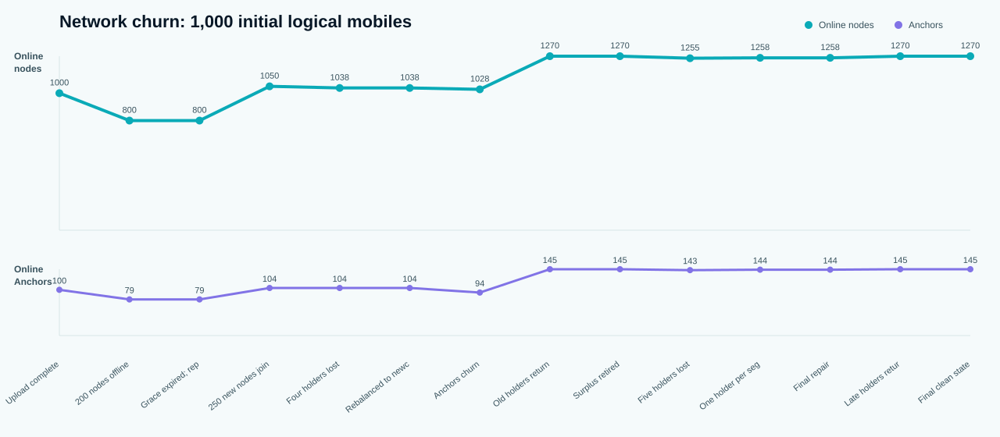
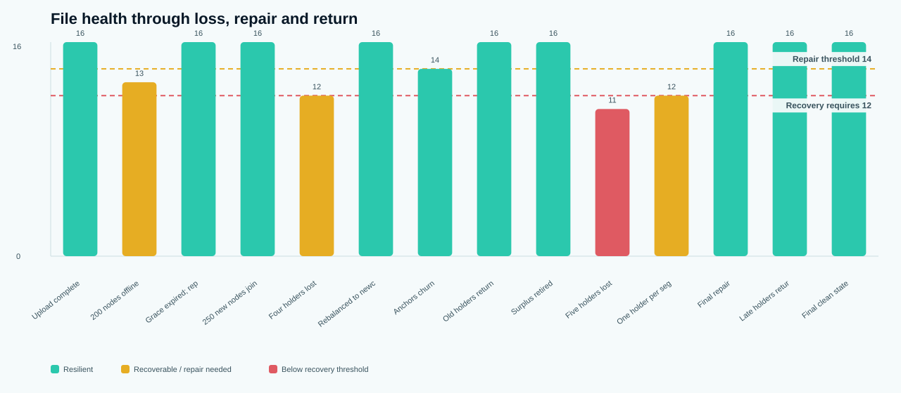
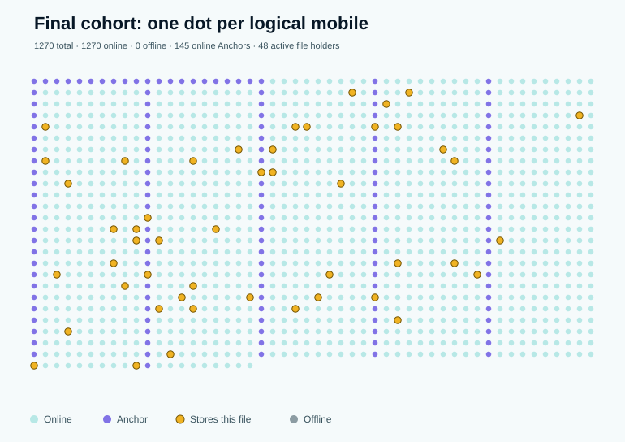

# TheMeshVault 1,000-node chaos and scale test

Date: 2026-07-27  
Result: **PASS**  
Machine-readable evidence: [results.json](test-artifacts/scale-chaos/results.json)

## Executive result

The test started with **1,000 logical mobile nodes**, uploaded and cryptographically processed a real 17.0 MiB file, removed nodes in several waves, introduced 250 new storage nodes and 20 additional Anchors, repaired lost shard placements, reconciled copies when old nodes returned, deliberately crossed the recovery threshold, and finally returned to a clean 12+4 state.

- Original SHA-256: `e0e6643ece89868e984a058c06b14161b5257a2af275c0119660e0f7d1e5b9d8`
- Final recovered SHA-256: `e0e6643ece89868e984a058c06b14161b5257a2af275c0119660e0f7d1e5b9d8`
- Exact byte comparison: **PASS**
- Recovery with four missing shards per segment: **PASS**
- Recovery with five missing shards per segment: **correctly blocked at 11/12**
- Recovery after one holder per segment returned: **PASS at exactly 12/16**
- Final active shard copies: **48 for 48 logical shards**
- Final live Anchor replicas: **3/3**
- Test runtime: **1613.6 ms**

## What was exercised with real production code

- Adaptive gzip with the current 5% threshold.
- AES-GCM encryption and decryption.
- SHA-256 for original, segment, ciphertext and shard verification.
- Production Reed–Solomon 12+4 encoding and reconstruction.
- Production erasure-profile selection.
- Production placement ranking using failure domain, geography, capacity, reliability, observed quality, throughput and RTT.
- Production resilience calculation.
- Production offline grace, repair planning and replica reconciliation.

The Anchor portion used the production two-copy target and real churn data, but modeled control-record replication in the harness. It did not open 1,000 browser tabs or WebRTC connections.

## Scenario log

| # | Event | Nodes online | Anchors | Anchor copies | Weakest segment | File state | Exact recovery | Physical copies |
| --- | --- | --- | --- | --- | --- | --- | --- | --- |
| 1 | Upload complete | 1000/1000 | 100 | 3/3 | 16/16 | resilient | verified | 48 |
| 2 | 200 nodes offline | 800/1000 | 79 | 3/3 | 13/16 | recoverable | not run | 48 |
| 3 | Grace expired; repaired | 800/1000 | 79 | 3/3 | 16/16 | resilient | verified | 57 |
| 4 | 250 new nodes join | 1050/1250 | 104 | 3/3 | 16/16 | resilient | not run | 57 |
| 5 | Four holders lost | 1038/1250 | 104 | 3/3 | 12/16 | recoverable | verified | 57 |
| 6 | Rebalanced to newcomers | 1038/1250 | 104 | 3/3 | 16/16 | resilient | verified | 69 |
| 7 | Anchors churn | 1028/1270 | 94 | 3/3 | 14/16 | recoverable | not run | 69 |
| 8 | Old holders return | 1270/1270 | 145 | 3/3 | 16/16 | resilient | verified | 69 |
| 9 | Surplus retired | 1270/1270 | 145 | 3/3 | 16/16 | resilient | verified | 48 |
| 10 | Five holders lost | 1255/1270 | 143 | 3/3 | 11/16 | degraded | blocked | 48 |
| 11 | One holder per segment returns | 1258/1270 | 144 | 3/3 | 12/16 | recoverable | verified | 48 |
| 12 | Final repair | 1258/1270 | 144 | 3/3 | 16/16 | resilient | verified | 60 |
| 13 | Late holders return | 1270/1270 | 145 | 3/3 | 16/16 | resilient | verified | 60 |
| 14 | Final clean state | 1270/1270 | 145 | 3/3 | 16/16 | resilient | verified | 48 |

## File and storage data

| Segment | Original | Stored before encryption | Compression | Saving | Shard size | Original holders |
| --- | --- | --- | --- | --- | --- | --- |
| 1 | 8.0 MiB | 23.9 KiB | gzip | 99.71% | 2.0 KiB | 16 |
| 2 | 8.0 MiB | 8.0 MiB | none | 0% | 683 KiB | 16 |
| 3 | 1.0 MiB | 4.3 KiB | gzip | 99.58% | 370 B | 16 |

- Original file: **17.0 MiB**
- Compressed representation: **8.0 MiB**
- Overall compression saving: **52.78%**
- Initial 12+4 physical shard storage: **10.7 MiB**
- Repair placements created: **33**
- Repair traffic represented by rebuilt shards: **7.4 MiB**
- Repairs correctly blocked below K: **15 planned shard copies**
- Surplus copies marked/retired: **33/33**
- Anchor replicas recreated/retired: **6/6**

## File-wide placement result

All three segment groups used 16 different failure domains and the complete file used **48 distinct devices** from the 1,000 eligible nodes. No device appeared in all three initial segment groups.

The production placement path now carries a shared file-level context across segments. It prefers devices that do not yet store part of the file, applies a soft per-node cap derived from file size and eligible-node count, and uses a stable file/segment/shard-specific weighted rendezvous score. Small meshes may reuse devices, but the load is kept balanced while every individual coding group remains on distinct failure domains.

## Returning nodes and temporary extra copies

Repairs created replacement copies while offline nodes still physically retained unreadable old shards. When those nodes returned, the test observed up to **69 physical copies for 48 logical shards**. Production reconciliation marked the duplicates as surplus, waited the configured five-minute grace period, and retired them deterministically. The final state returned to 48 active and physical copies.

This confirms the UI should distinguish:

- logical profile size;
- currently active/reachable copies;
- temporary or offline physical surplus.

## Placement observations

- Eligible initial nodes: **1000**
- Original unique file holders: **48**
- Countries represented by original holders: **20**
- Average reliability, selected holders: **0.8115**
- Average reliability, all initial nodes: **0.7804**
- Newly joined nodes used by the second repair wave: **7 placements**
- Final independent failure domains per segment: **16**

## What this test does not prove

- The 1,000 mobiles are logical nodes in one Node.js process, not 1,000 browser or phone processes.
- Shard bytes, compression, AES-GCM, SHA-256 and Reed-Solomon are real; WebRTC packet delivery, NAT traversal, radio use, battery and mobile background suspension are not exercised here.
- Anchor membership, outages and the configured two-copy target are modeled; 1,000 live Anchor peer connections are not opened.
- Supabase throughput, Realtime fan-out, RLS contention and anonymous-auth rate limits are not load-tested.
- The harness retains validation fixtures centrally so it cannot be used as evidence that production never stores file bytes centrally; the separate Golden Recovery Test covers that boundary.

Running 1,000 real mobile browsers on one workstation would mostly test that workstation's RAM, process, WebRTC socket and operating-system limits. The useful next physical tier is approximately 20–50 real phones across several networks, with long-running background/screen-off tests, while this 1,000-node logical test remains the fast reproducible chaos gate.
